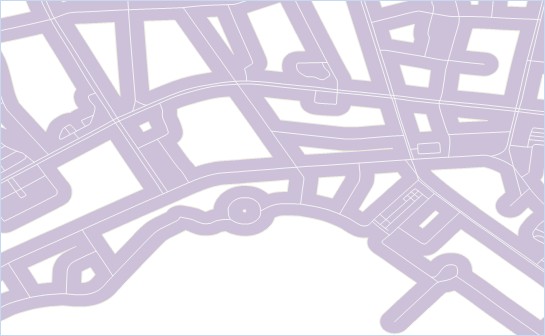
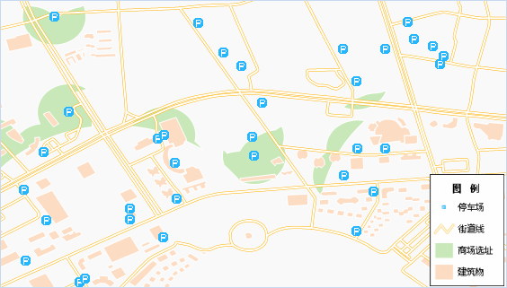

缓冲区分析应用实例

**主题：青岛某区域大型商场选址**

在城市中，如何为大型商场找到一个交通便利、停车方便、人员密集的商业地段是开发商最为关注的问题。因此，商场选址需对多方面因素进行分析，选出最适宜地址，获得最大的经济效益。本实例选址的目标和标准如下：

-   保证商场在居民区100m范围内，便于居民步行能达到商场；
-   离城市交通线路50m以内，保证商场的通达性；
-   距停车场100m范围内，便于顾客停车；
-   距离已存在商场500m范围外，减少竞争压力。

**数据准备**

-   主要居民区面数据集；
-   主要交通道路线数据；
-   停车场点数据集；
-   已有大型商场点数据集。

**操作步骤**

1.  以居民区数据为中心，建立距离为100m的缓冲区，如下图所示：
      ---------------------------------
      
      图：居民区缓存区分析
      ---------------------------------

2.  以主要交通道路为中心，建立50m的缓冲区，如下图所示：
      ---------------------------------
      
      图：主要道路缓存区分析
      ---------------------------------

3.  以停车场和已存在的大型商场点数据为中心，分别建立100m和500m缓冲区，得到结果如下图所示：
      ---------------------------------
      
      图：停车场和已有商场缓存区分析
      ---------------------------------

4.  将居民区缓冲区、道路缓冲区、停车场缓冲区进行叠加分析求交，再将求交的结果与已存在商场缓冲区做擦除，满足以上条件的区域即适合建大型商场，下图中的绿色区域适宜建造大型商场。
      ---------------------------------
      
      图：适宜建造商城区域
      ---------------------------------

###  相关主题

 [缓冲区分析原理](BufferTheory.htm)

[生成单重缓冲区](../bufferanalyst/SingleBuffer.htm)

[生成多重缓冲区](../bufferanalyst/MutilBuffer.htm)

------------------------------------------------------------------------

  --------------------------------
  
  --------------------------------

