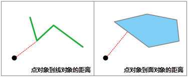

### 使用说明

距离计算可用于计算点到点、线、或面的距离，可计算指定查询范围内点、线或面到被计算点的距离，计算结果保存在一个新的属性表中，字段包括：源数据点的ID，临近要素ID（点、线或面要素），以及它们之间的距离值。

### 应用场景

距离计算功能可查看两组事物间的邻近性关系。例如，若您需要比较多种类型的企业点（如影剧院、快餐店、工程公司或五金商店）与社区问题（乱丢废弃物、打碎窗玻璃、乱涂乱画）所在位置之间的距离，可将搜索限制为一公里来查找关系。然后计算出企业和社区问题的距离将保存到属性表中，该结果用于安排公用垃圾桶或巡警。

使用距离计算还可查找：与受污染井距离在指定范围内的所有水井和距离。

### 操作步骤

1.  在“**分析**”选项卡上的“**矢量分析**”组中，单击“**邻近分析**”按钮，在弹出的下拉菜单中选择"距离计算"项，弹出“距离计算”对话框。
2.  设置源数据：
    -   **数据源：**选择需进行距离计算的点数据集所在的数据源。
    -   **数据集：**选择点数据集或网络数据集，在距离计算时作为起点。若选择网络数据集，则参与计算的数据为其中的节点数据。
    -   **过滤表达式：**可以通过过滤表达式来过滤参与对象，使满足条件的点对象参与计算，关于如何使用SQL表达式，请参阅[SQL表达式对话框](../../../Query/SQLDia.htm)。

3.  设置邻近数据：
    -   **数据源：**选择参与距离计算的邻近数据所在的数据源。
    -   **数据集：**选择参与距离计算的邻近数据，可选择点、线、面或网络数据集，在距离计算时作为终点。
    -   **过滤表达式：**可以通过过滤表达式来过滤参与对象，使满足条件的对象参与计算，关于如何使用SQL表达式，请参阅[SQL表达式对话框](../../../Query/SQLDia.htm)。

4.  参数设置：

    **计算方式：**单击组合框右侧的下拉按钮，可选择距离计算的计算方式，包括最近距离、范围内距离两种。

    -   **最近距离：**即从源数据集中的点对象出发，根据设置的查询范围，计算查询范围内邻近对象与源对象之间的距离，并记录距离最近的一个或多个对象ID和距离值。若选择的计算方式为“最近距离”，可在“查询范围设置”处勾选最小距离或最大距离复选框，设置距离计算的最小或最大距离值，单位与数据集单位一致。设置最大、最小距离后，只有与源数据集点对象距离大于最小距离、小于最大距离（包括等于）的邻近对象参与计算。

    -   **范围内距离：**即从源数据集中的每一个点对象出发，计算每个邻近对象与源对象之间的距离，并根据设置的查询范围，返回距离在最大最小范围内的所有对象ID和距离值。选择“范围内距离”计算方式后，需设置最小、最大距离值，单位与数据集单位一致。

5.  设置结果数据集保存名称和保存在的数据源：
    -   **数据源：**选择结果数据集所要保存在的数据源。
    -   **数据集：**输入生成的结果数据集名称，如果输入的数据集名称已经存在，则会提示数据集名称非法，需要重新输入。

6.  **关联浏览结果**：勾选该复选框后，可将源数据、邻近数据打开到同一个地图窗口中，并与结果属性表数据集进行关联浏览。
7.  操作完成自动关闭对话框：选中该复选框后，则在执行完距离计算操作后，将自动关闭“距离计算”对话框；否则，不会自动关闭对话框。
8.  设置好以上参数后，点击“确定”按钮，即可执行距离计算操作，下图为计算最近距离的结果数据：

###  注意事项

1.  源数据集与邻近数据集的必须具有相同的坐标系。
2.  点到线对象的距离，是计算点到整个线对象的最小距离，即在线上找到一点与被计算点的距离最短；同样的，点到面对象的距离，是计算点到面对象的整个边界的最小距离，如下图所示：

   

3.  计算两个对象间距离时，出现包含或（部分）重叠的情况时，距离均为 0。例如点对象在线对象上，二者间距离为 0。

###  相关主题

[距离计算原理](DistanceMeasure_Theory.html)

[距离计算应用实例](DistanceAnalyst_Example.html)
